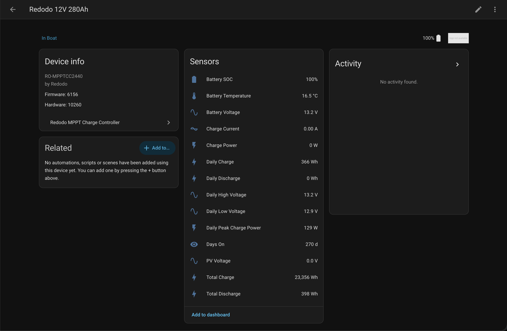

# Redodo MPPT — Home Assistant Integration

A custom Home Assistant integration for **Redodo MPPT charge controllers**, communicating over Bluetooth Low Energy using a reverse-engineered Modbus RTU protocol.

> **Tested hardware:** Redodo RO-MPPTCC2440 (40A, 12/24V)
> Other Redodo MPPT models may work but are untested. Open an issue if you try one.

---



## Features

- 14 sensors exposed as native HA entities
- Live readings updated every 30 seconds over BLE
- Auto-reconnect on Bluetooth drop

**Sensors:**

| Sensor | Unit |
|---|---|
| Battery SOC | % |
| Battery Voltage | V |
| Charge Current | A |
| Charge Power | W |
| Battery Temperature | °C |
| PV Voltage | V |
| Daily Charge | Wh |
| Daily Discharge | Wh |
| Daily Peak Charge Power | W |
| Daily High Voltage | V |
| Daily Low Voltage | V |
| Total Charge | Wh |
| Total Discharge | Wh |
| Days On | days |

---

## Requirements

- Home Assistant with the **Bluetooth** integration enabled
- HA host with a BLE adapter in range of the controller
- Python 3.12+

---

## Installation

### HACS (recommended)

1. Add this repository as a custom repository in HACS
2. Search for "Redodo MPPT" and install
3. Restart Home Assistant

### Manual

1. Copy the `custom_components/redodo_mppt/` directory into your HA config's `custom_components/` folder
2. Restart Home Assistant

---

## Configuration

1. Go to **Settings → Devices & Services → Add Integration**
2. Search for **Redodo MPPT Charge Controller**
3. Select your controller from the discovered BLE devices list
4. Done — the integration will connect and start polling

---

## Register Map

All registers were reverse-engineered from Bluetooth snoop logs and confirmed by cross-referencing against the official Redodo app display. CRC16-Modbus values have been verified against captured traffic.

### Real-time block (`0x0101`, 19 registers)

| Address | Constant | Description | Scaling | Status |
|---|---|---|---|---|
| 0x0101 | `REG_SOC` | Battery state of charge | direct % | ✅ |
| 0x0102 | `REG_BATT_VOLTAGE` | Battery voltage | ÷10 V | ✅ |
| 0x0103 | `REG_CHARGE_CURRENT` | Charge current | ÷100 A | ✅ |
| 0x0104 | `REG_CHARGE_POWER` | Charge power | direct W | ✅ |
| 0x0105 | `REG_BATT_TEMP` | Battery temperature | ÷100 °F | ✅ |
| 0x0106 | `REG_UNK_106` | Unknown | — | ❓ always 0 |
| 0x0107 | `REG_UNK_107` | Unknown | — | ❓ always 0 |
| 0x0108 | `REG_UNK_108` | Unknown | — | ❓ always 0 |
| 0x0109 | `REG_PV_VOLTAGE` | Solar panel voltage | ÷10 V | ✅ |
| 0x010A | `REG_CHARGE_MAX_POWER` | Daily peak charge power | direct W | ✅ |
| 0x010B | `REG_CHARGE_AMOUNT` | Daily charge energy | direct Wh | ✅ |
| 0x010C | `REG_UNK_10C` | Unknown | — | ❓ always 0 |
| 0x010D | `REG_UNK_10D` | Unknown | — | ❓ observed 0 or 2 |
| 0x010E | `REG_UNK_10E` | Unknown | — | ❓ always 0 |
| 0x010F | `REG_DAYS_ON` | Days on-time | direct days | ✅ |
| 0x0110 | `REG_UNK_110` | Unknown | — | ❓ always 0 |
| 0x0111 | `REG_CHARGE_AMOUNT_CUMULATIVE` | Lifetime total charge | direct Wh | ✅ |
| 0x0112 | `REG_UNK_112` | Unknown | — | ❓ always 0 |
| 0x0113 | `REG_DISCHARGE_AMOUNT_CUMULATIVE` | Lifetime total discharge | direct Wh | ✅ |

### Secondary real-time block (`0x0400`, 5 registers)

| Address | Constant | Description | Scaling | Status |
|---|---|---|---|---|
| 0x0400 | `REG_DAILY_CHARGE_AMOUNT` | Daily charge (mirrors 0x010B) | direct Wh | ✅ |
| 0x0401 | `REG_DAILY_DISCHARGE_AMOUNT` | Daily discharge energy | direct Wh | ✅ |
| 0x0402 | `REG_DAILY_CHARGE_MAX_POWER` | Daily peak charge power | direct W | ✅ |
| 0x0403 | `REG_DAILY_BATT_V_HIGHEST` | Daily high battery voltage | ÷10 V | ✅ |
| 0x0404 | `REG_DAILY_BATT_V_LOWEST` | Daily low battery voltage | ÷10 V | ✅ |

### Configuration block (`0x0201`, 17 registers)

| Address | Constant | Description | Scaling | Status |
|---|---|---|---|---|
| 0x0201 | `REG_BATT_TYPE` | Battery type (1 = LiFePO4) | — | ✅ |
| 0x0202 | `REG_SYS_VOLTAGE` | System voltage | direct V | ✅ |
| 0x0203 | `REG_CHARGE_STAGES` | Number of charge stages | — | ✅ |
| 0x0204 | `REG_ABSORPTION_V` | Absorption voltage | ÷10 V | ✅ |
| 0x0205 | `REG_EQUALIZATION_V` | Equalisation voltage | ÷10 V | ✅ |
| 0x0206 | `REG_FLOAT_V` | Float voltage | ÷10 V | ✅ |
| 0x0207 | `REG_BOOST_RETURN_V` | Boost return voltage | ÷10 V | ✅ |
| 0x0208 | `REG_LOW_BATT_WARN_V` | Low battery warning threshold | ÷10 V | ✅ |
| 0x0209 | `REG_LOW_BATT_CUT_V` | Low battery cutoff voltage | ÷10 V | ✅ |
| 0x020A | `REG_OVERDISCH_V` | Over-discharge protection | ÷10 V | ✅ |
| 0x020B | `REG_DISC_RECONNECT_V` | Discharge reconnect voltage | ÷10 V | ✅ |
| 0x020C | `REG_THRESH_12` | Unknown threshold | ÷10 V? | ❓ |
| 0x020D | `REG_TIMER_1` | Unknown timer | hours? | ❓ |
| 0x020E | `REG_TIMER_2` | Unknown timer | hours? | ❓ |
| 0x020F | `REG_MAX_CHARGE_A` | Max charge current | direct A | ✅ |
| 0x0210 | `REG_LOAD_SETTING` | Unknown load setting | — | ❓ |
| 0x0211 | `REG_LOAD_MAX` | Unknown load max | — | ❓ |

### Status registers

| Address | Constant | Description | Status |
|---|---|---|---|
| 0x0121 | `REG_STATUS_1` | Status / fault flags? | ❓ not decoded |
| 0x0122 | `REG_STATUS_2` | Status / fault flags? | ❓ not decoded |

### Known gaps

- **MPPT controller temperature** — probed registers 0x0114–0x011A, all returned zero. Location unknown or not exposed over Modbus.

---

## CLI Debug Tool

A standalone script for register exploration, useful if you want to map registers on a different model:

```bash
# Interactive BLE scan — pick your device
python cli.py

# Connect directly by address/UUID
python cli.py --address C8:47:80:07:E8:78

# Poll every 10 seconds
python cli.py --address C8:47:80:07:E8:78 --interval 10
```

Prints all known `REG_*` constants with their current raw values, sorted by address.

---

## Protocol Notes

- **BLE service:** `0xFFE0` / `0000ffe0-0000-1000-8000-00805f9b34fb`
- **Characteristic:** `0xFFE1` (Write Without Response + Notify)
- **Transport:** Modbus RTU frames sent as GATT write commands; responses arrive as notifications on the same characteristic
- **Framing:** Standard FC03 (Read Holding Registers) with CRC16-Modbus, except the config block which uses a non-standard 10-byte command with an embedded extension field

---

## License

MIT
